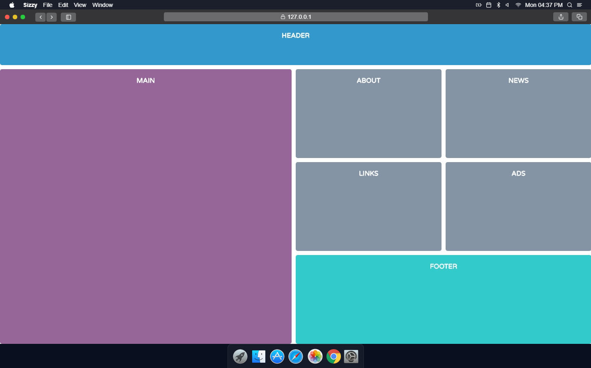

# CSS Grid Layout
 A simple layout utilizing HTML and CSS Grid.
 
 
## Steps to execute this calculator:
- Download the entire code 
- Open up the index.html.
- Resize window to view responsive grid change dimensions in real time.

## Technologies used: 
- HTML
- CSS [style/Presentation]
